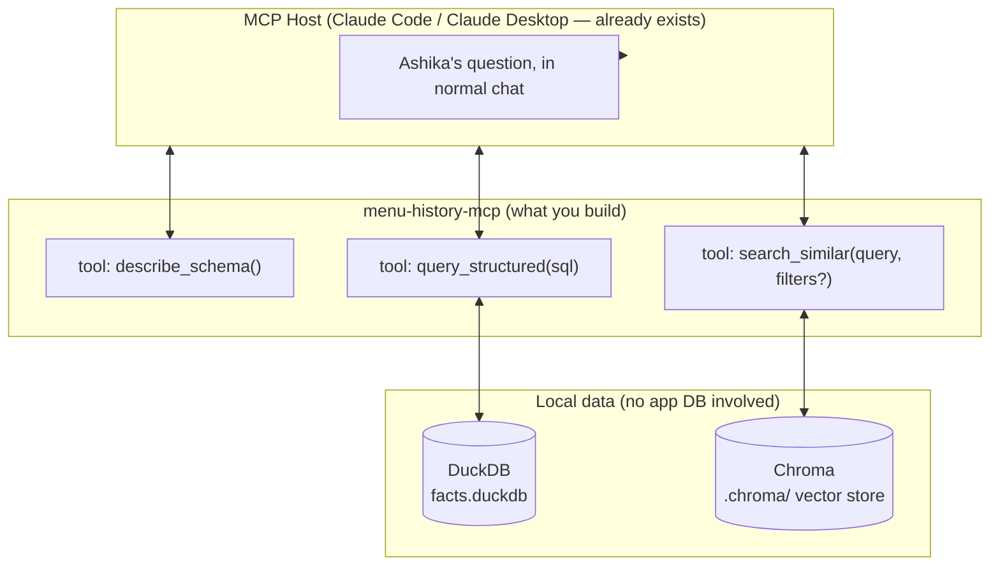
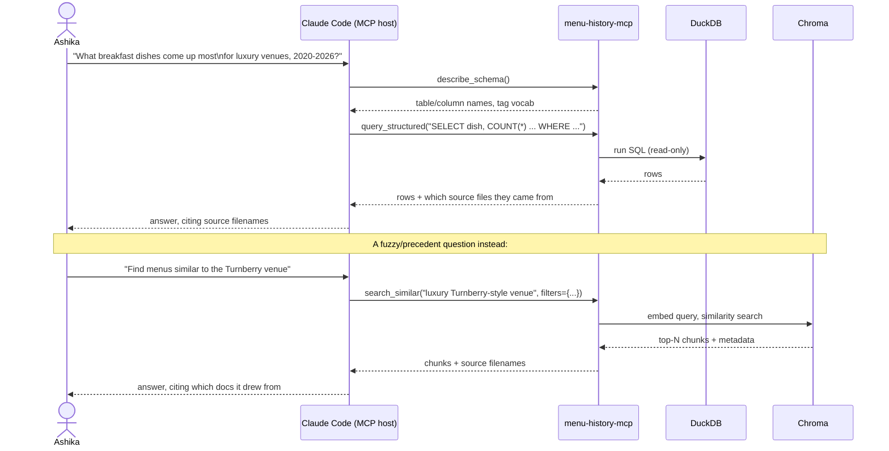

# Menu History RAG/MCP — Design

Standalone research tool. **Not** part of the Next.js app, **not** wired into
`MenuGenerator.ts`, **does not write to the app's Postgres database.** Built
as an **MCP server** so it plugs into a chat host (Claude Code / Claude
Desktop) you already use — no custom chat UI or agent loop to write.
Ashika (or you) asks natural-language questions about ~20 years of
historical menu docs (`menus-source/MENU FOLDER/`) in normal chat; the host
decides which of this server's tools to call and answers with citations
back to source files. It answers questions — it does not generate menus.

## Why two data layers, not one

Two distinct question shapes show up against this corpus, and each is only
answered correctly by a different mechanism:

| Question shape | Example | Wrong tool would... |
|---|---|---|
| **Exact / aggregate** — needs to reason over *every* matching doc | "What dishes come up most for breakfast, luxury venues, 2020–2026?" "How has avg price/person moved since 2015?" | Vector search only samples top-N similar chunks → silently undercounts, confidently wrong. |
| **Fuzzy / precedent** — no fixed taxonomy to filter on | "Find menus with a similar vibe/venue to the Turnberry wedding." "What does a Rajasthani–Telugu fusion sangeet typically look like?" | Exact filters only work on clean tags — venue is free text, "vibe" isn't a column. |

So: one **structured** layer (exact filters + counts) and one **semantic**
layer (embedding similarity), both exposed as tools, and the chat host picks
per-question — same as it already picks between any of its other tools.

## Architecture

## The three tool contracts to implement

These are the only three things the MCP server needs to expose. Get their
input/output shapes right and the host handles all the routing/reasoning.

**`describe_schema()`** — no arguments. Returns the DuckDB table name(s),
column names/types, and the controlled vocabularies already defined in
`menu_etl_pipeline.py` (`CUISINE_TAGS`, `COURSES`, `OCCASION_SUITABILITY`,
etc.) so the host writes SQL using values that actually exist in the data,
not guesses.

**`query_structured(sql: str)`** — runs a **read-only** SQL query against
the DuckDB facts table, returns rows as JSON (including a source-file column
on every row, so answers are always traceable). Reject/refuse anything that
isn't a `SELECT` (no need to expose write access — this tool only ever
answers questions, never mutates data).

**`search_similar(query: str, filters: dict | None)`** — embeds `query`,
optionally pre-filters by structured metadata (occasion/year/cuisine tag) if
`filters` given, then ranks the remainder by embedding similarity. Returns
top-N chunks with their text, source filename, and any metadata — again,
always traceable back to a real doc.

## Data layer 1 — structured facts (DuckDB)

Source: `extracted/*.json` (100 docs already run through
`menu_etl_pipeline.py`'s `extract` stage) + `seed/dish_review.csv` +
`seed/menu_items_seed.json` — flatten into one row per (dish, menu) with at
minimum: `source_file`, `year` (parse from folder/filename — the source
tree is already organized by year), `occasion_type_guess`, `price_per_person`,
`dish_name`, `course`, `cuisine_tags` (array), `is_staple`.

Open question you'll hit early: 93 of the 229 source files are legacy `.doc`
(pre-.docx Word format) — the existing `extract_text_from_docx`/
`extract_text_from_pdf` functions in `menu_etl_pipeline.py` can't read them,
and neither can most Python libraries without help. Options: convert with
LibreOffice headless (`soffice --headless --convert-to docx`) first, or note
which years are affected and decide if it's worth it before building around
it.

## Data layer 2 — semantic chunks (Chroma)

Chunk **per menu, not per doc** — a single doc can contain 2-3 distinct
menus at different price points (same reason `menu_etl_pipeline.py`'s
extraction schema treats "menus" as an array per doc, not one blob). Each
chunk = one menu's text + metadata (source filename, year, occasion guess,
price). Embed with your chosen provider (see checklist) and store in a
local Chroma collection.

## What you need to build this

**Concepts (MCP)**
- MCP has three roles: *host* (the chat app — Claude Code/Desktop, already
  built, not your job), *server* (what you're building), *client* (the
  connector between them, handled by the SDK).
- Local servers use **stdio transport** (simplest — the host launches your
  script as a subprocess and talks over stdin/stdout). No need for
  HTTP/SSE for a local personal tool.
- Tools are defined with a name, description, and JSON-schema input — same
  shape as Claude's native tool-use `input_schema`, if you've seen that.
- Python SDK: `pip install mcp` — the `FastMCP` class lets you register a
  tool with a `@mcp.tool()` decorator over a plain function; it derives the
  JSON schema from your function's type hints and docstring.
- Reference: modelcontextprotocol.io has the spec + Python SDK quickstart.

**Structured layer**
- `pip install duckdb` — file-based, no server process, reads
  JSON/CSV directly or you load once into a persisted `.duckdb` file.
- No new API key needed for this layer.

**Semantic layer**
- Embedding provider — pick one:
  - **Voyage AI** (`voyage-3.5`) — what Anthropic recommends pairing with
    Claude, cheap, good quality. Needs a `VOYAGE_API_KEY` (separate signup,
    has a free tier). `pip install voyageai`.
  - **Local, no API key**: `pip install sentence-transformers`, e.g.
    `all-MiniLM-L6-v2` — free, runs on your machine, slightly lower
    retrieval quality, first run downloads the model (~80MB).
- `pip install chromadb` — local, file-based vector store
  (persists to a folder, e.g. `.chroma/`, gitignore it).
- Doc/PDF text extraction — reuse `extract_text_from_docx` /
  `extract_text_from_pdf` already in `menu_etl_pipeline.py`
  (`pip install python-docx pdfplumber`, already project dependencies).
- **Optional**: LibreOffice installed locally, only if you decide to
  convert the 93 legacy `.doc` files (`soffice --headless --convert-to docx
  --outdir <out> <file>.doc`).

**Wiring it up**
- No `ANTHROPIC_API_KEY` needed *inside the server* — the LLM call happens
  in the host (Claude Code/Desktop), not your server. Your server only
  serves data. (You will need `VOYAGE_API_KEY` if you pick Voyage, since
  *your* server does the embedding calls itself.)
- Register the finished server with Claude Code via a project-level
  `.mcp.json` (or `claude mcp add <name> -- python path/to/server.py`) —
  same mechanism you can see already wiring up other MCP servers in this
  session.

## Suggested build order

1. **Structured layer first** — no new accounts needed, fastest feedback
   loop. Flatten the extracted JSON into DuckDB, hand-write some SQL
   yourself to sanity check ("count dishes by occasion + year") before any
   agent touches it.
2. **`describe_schema()` + `query_structured()` as MCP tools** — get the
   simplest possible MCP server running and talking to Claude Code, proving
   the wiring works, before adding the harder embedding piece.
3. **Semantic layer** — chunking + embeddings + Chroma, tested standalone
   (a plain Python script that embeds a query and prints top-N matches)
   before wrapping it as a tool.
4. **`search_similar()` as the third MCP tool.**
5. Ask it real questions in chat and see where it picks the wrong tool or
   writes bad SQL — that's the actual debugging loop for this kind of system.

## Non-goals (unchanged)

- Does **not** write to the app's Postgres DB or touch `prisma/schema.prisma`.
- Does **not** call or modify `src/server/generation/MenuGenerator.ts`.
- Does **not** auto-generate the 3-tier blueprint — it answers research
  questions; a human turns the answers into the actual blueprint/rules.
