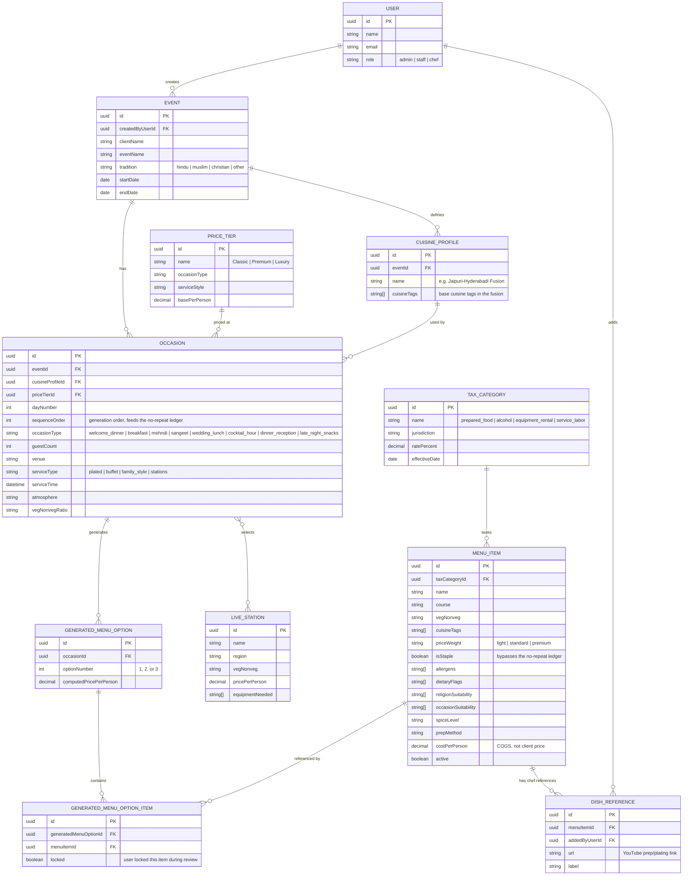
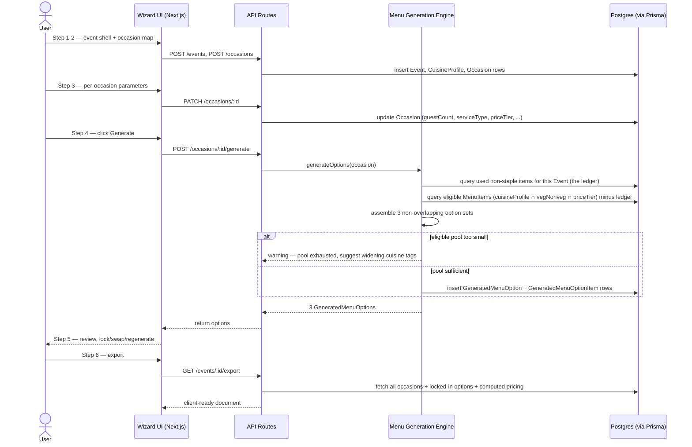
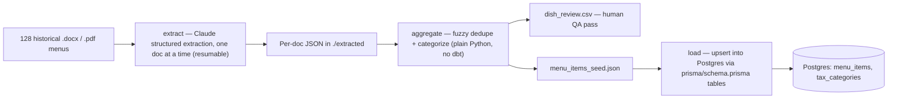

# Madras Catering Menu Generator — Design Spec & UML

This consolidates every decision made so far into one reference: the data model (as an ER diagram and the full Prisma schema), the wizard/generation flow (as a sequence diagram), and the ETL pipeline (as a flowchart). Diagrams are Mermaid — they render natively on GitHub, so this file can live in the repo as-is.

## 1. Decisions this reflects

Stack: Next.js (React + TypeScript) as a single monolith — frontend and API routes together, not a separate Express backend — using Prisma as the ORM against Postgres, hosted on Vercel with a serverless-pooled Postgres provider (Neon or Supabase). Data pipeline: a three-stage Python ETL (`extract` → `aggregate` → `load`) turns the 128 historical menu docs into seed data, using an LLM for structuring rather than dbt, since the categorization logic is simple enough to live as plain code at this data volume. No RAG index — this is one-time structured extraction, not query-time retrieval.

Multi-user access: three roles — `admin` (dish library, tax rates, user management — you), `staff` (create/edit events and generate menus), `chef` (read-only on generated menus, plus adding/viewing the YouTube reference links below). All authenticated users see all events; this is a small internal team, not a client-facing multi-tenant system, so there's no per-event sharing/permission model yet — every `Event` just records who created it (`createdByUserId`) for accountability, not access control. Auth itself isn't custom-built: recommend Auth.js (formerly NextAuth) with its official Prisma adapter, using either magic-link email sign-in or Google OAuth if your team already uses Google Workspace — both skip building password reset/hashing yourself.

Chef references: dishes can carry reference links (YouTube prep videos, plating walkthroughs) via a separate `DishReference` table rather than a single URL field on `MenuItem`, so a dish can have more than one link (e.g. "prep" and "plating" as separate entries), each one tracked to whoever added it.

## 2. Data model (ER diagram)

Notable design choices baked into this model:

The **no-repeat ledger is a derived query, not a stored table** — "which non-staple items has this event already used" is answered by joining `GENERATED_MENU_OPTION_ITEM → GENERATED_MENU_OPTION → OCCASION → EVENT` and filtering to non-staple `MENU_ITEM`s, scoped to the event, ordered by `Occasion.sequenceOrder`. Storing it separately would just be state that can drift out of sync with the real data.

A **Cuisine Profile belongs to the Event, not a single Occasion** — that's what lets one event carry a "Jaipuri-Hyderabadi Fusion" profile used by most occasions while a specific occasion (say, the mehndi) points at a second profile if you add one, per the multi-fusion requirement from earlier.

**Tax lives on its own table, referenced by name/ID from `MENU_ITEM`** — never a rate stored per dish — so a rate change is one row update, not a rewrite across the whole item library.

## 3. Wizard & generation flow (sequence diagram)

## 4. ETL pipeline (flowchart)

## 5. Full Prisma schema

This supersedes the earlier `schema.prisma`, which only covered the two tables the ETL pipeline writes to (`MenuItem`, `TaxCategory`). The full application needs the rest of the model above — see `schema-full.prisma` alongside this file. The ETL `load` step still only touches `menu_items` and `tax_categories`; the wizard's own API routes own `Event`, `CuisineProfile`, `Occasion`, `PriceTier`, `LiveStation`, and the `GeneratedMenuOption*` tables.

## 6. Open items this design intentionally leaves for later

`GeneratedMenuOption` doesn't yet version history (e.g., "what did option 2 look like before I swapped a dish") — add an audit table if you want that later. Live station pricing is treated as a flat per-person add-on; if stations end up needing tiered pricing like menu items do, `LiveStation` will want its own `priceWeight`-style field. Per-event sharing/permissions (restricting a specific event to specific staff) isn't modeled — everyone with an account currently sees every event; add an `EventCollaborator` join table if that ever needs to be locked down. And the `chef` role's actual write scope isn't nailed down yet — the schema lets any authenticated user create a `DishReference`, so decide whether that should be chef-only, staff-and-up, or open to everyone before you wire up the permission checks in the API routes.